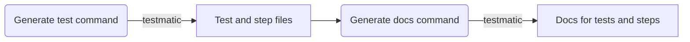

# testmatic

> ⚡️ Supercharge your end-to-end testing ⚙️

Testmatic is a framework and command-line tool for quickly and easily writing and organising end-to-end tests.

Simple, human-readable lists of **_steps_** are grouped into **_tests_** and can be further organised by various types of **_tags_**.

Documentation is automatically generated in Markdown format, suitable for viewing in the Web interface of a version control repository (e.g. GitHub or BitBucket).

You can place links to Testmatic documentation in external documentation, such as a Wiki, Chat channel or email.

You can link to:

- **_A test_**
  - For example: "User can Login using valid credentials"
    - [/blob/main/docs/tests/recent_topics_are_listed.md](/blob/main/docs/tests/recent_topics_are_listed.md)
- **_A step_**
  - For example: "Enter username: test@website.com"
    - [/blob/main/docs/steps/go_to_wikipedia.md](/blob/main/docs/steps/go_to_wikipedia.md)
- **_A tags's tests_**
  - For example: "All tests for Search (Screen)"
    - [/blob/main/docs/tags/search_screen.md](/blob/main/docs/tags/search_screen.md)

## Benefits of testing

Research indicates that thorough testing is critical to success in software projects. According to one study, software failures in the US alone cost the economy USD 1.1 trillion in assets in 2016 and impacted 4.4 billion customers. <sup>1</sup>

---

<sup>1</sup> [https://www.cloudcomputing-news.net/news/2017/oct/30/glitch-economy-counting-cost-software-failures/](https://www.cloudcomputing-news.net/news/2017/oct/30/glitch-economy-counting-cost-software-failures/)

## Benefits of using testmatic for your test cases

Some key benefits of testmatic:

1. Testing steps are simple and easy for people to read
2. Testing steps support simple, fast and rigorous manual testing
3. Testmatic tests can be incrementally automated
4. Testmatic tests are easy to link to
5. Testmatic tests can be hosted in version control, with zero third-party dependencies or additional setup
6. Testmatic tests are version-controlled
7. Testmatic tags provide a powerful way to group related tests

### 1. Testing steps are simple and easy for people to read

Given/When/Then syntax is cumbersome and requires a learning curve and is generally the domain of software engineers.

In contrast, simple lists of testing steps, much like the method in a cooking recipe, are easy to understand for a broad set of people.

### 2. Testing steps support simple, fast and rigorous manual testing

It's easier and faster to manually test software when you are clear on what specific actions need to be taken and in what order.

By documenting and organising testing procedures, manual testing can be performed consistently, ensuring a rigorously tested product.

### 3. Testmatic tests can be incrementally automated

Testmatic focusses on helping you write and organise your testing steps first, generating empty placeholder functions without you having to immediately write code to automate them.

If and when you decide to add automation, it's easy to locate the places in which to write code, and you can automate step by step, rather than having to automate a whole test sequence all at once.

### 4. Testmatic tests are easy to link to

You can share your test steps with team members and stakeholders easily.

You can link to a whole test, or a list of related tests.

### 5. Testmatic tests can be hosted in version control, with zero third-party dependencies or additional setup

This makes it easy to get started quickly - simply fork the testmatic project, begin generating and committing your tests, and push to your own repository.

If your organisation has a version control system, and you have permission to create a new repository, you already have everything you need to get started.

### 6. Testmatic tests are version-controlled and implemented in code

As your testmatic instance is a forked Git repository by default, you reap all the benefits of version control - tracking the history of changes, branching, ability to revert changes, etc.

As tests, steps and tags are stored internally as Typescript code, you can easily make modifications - large or small - using the standard tools of your IDE. For example, in VS Code, you can rename a token and automatically have it update all usages, by renaming the file with [Update imports on file move](https://code.visualstudio.com/docs/typescript/typescript-refactoring#_update-imports-on-file-move) and [Rename symbol](https://code.visualstudio.com/docs/editor/refactoring#_rename-symbol).

### 7. Testmatic tags provide a powerful way to group related tests

For example, you can instantly retrieve a list of all tests for a particular screen, e.g. Login screen or Dashboard screen.

Or you can instantly retrieve a list of tests that utilise a particular test account.

These lists can be conveniently linked from external repositories of information, such as a Solution design in a Wiki, a task tracking system or company chat.

For example, a wiki page for the Login screen could link to a testmatic doc listing all tests for that screen: http://github.com/myaccount/mytests/blob/main/docs/tags/login_screen.md.

## Getting started

You can get started by simply **forking the testmatic repo**.

### What you'll need

- [Git](https://git-scm.com/)
- [Node.js](https://nodejs.org/en/download/) version 16.14 or above:
  - When installing Node.js, you are recommended to check all checkboxes related to dependencies.

## Fork Testmatic

1. On GitHub.com, navigate to the testmatic/testmatic repository.
2. In the top-right corner of the page, click Fork.
3. Under "Owner," select the dropdown menu and click an owner for the forked repository.
4. By default, forks are named the same as their upstream repositories. Optionally, to further distinguish your fork, in the "Repository name" field, type a name.
5. Optionally, in the "Description" field, type a description of your fork.
6. Optionally, select Copy the DEFAULT branch only.
7. For many forking scenarios, such as contributing to open-source projects, you only need to copy the default branch. If you do not select this option, all branches will be copied into the new fork.
8. Click Create fork.

You can then checkout to a local folder.

```bash
git clone https://github.com/myname/mytestmatic
```

And install the dependencies using npm.

```bash
npm install
```

Congratulations! You now have a working Testmatic project.

## Guide

### Adding a test and generating docs

Run the development server:

```bash
cd my-website
npm run start
```

The `cd` command changes the directory you're working with. In order to work with your newly created Docusaurus site, you'll need to navigate the terminal there.

The `npm run start` command builds your website locally and serves it through a development server, ready for you to view at http://localhost:3000/.

Open `docs/intro.md` (this page) and edit some lines: the site **reloads automatically** and displays your changes.

### How testmatic works

Testmatic stores your tests, steps and tags as Typescript code files.

These files are generated / re-generated whenever you run the `testmatic gen test`, `testmatic gen step` or `testmatic gen token` commands in the CLI.

When you run `gen docs`, Testmatic reads the Typescript code files and uses them to generate documentation.



### Generating tests

To generate a test, simply run `testmatic gen test`, fill in the title and testing steps, and then enter an empty line to finish.

```bash
$ testmatic gen test
Please enter test title: User can log in

Thank you!

Now, please enter your steps, one-by-one.
(Empty line to finish)

1. Go to homepage
2. Click Login button
3. Input valid username of a registered user
4. Input password of a registered user
5. Click Submit
6. Observe that the header account area indicates that the user is logged in
7.
$
```

Testmatic will generate your test file.

> Warning: If a test matching the name already exists, Testmatic will overwrite it with your new test. However, if any matching steps already exist, Testmatic will not overwrite them.

### Generating steps

TO generate an individual step, simply run `testmatic gen step`, fill in the step name, and then press Enter/Return.

```bash
$ testmatic gen step
Please enter step: Click Register button
$
```

Testmatic will generate your step file.

### Adding tags

Tags can be attached to test titles and/or test steps and later used for cross-referencing and to help with automation tests (if you decide to add any).

Tags are surrounded by square brackets and the tag type surrounded by rounded brackets.

For example the following test step references a tag named "Account settings", of type "screen":

```
1. Go to [Account settings (screen)]
```

To add a token, simply reference it in a test or step and testmatic will do the rest.

For example, if you run the following command, testmatic will generate the "Account settings" token of type "screen":

```bash
$ testmatic gen step
Please enter step: Go to the [(Account settings screen)]
$
```

Please note that you'll need to use testmatic `gen test` or `gen step` commands, in order for your new token to be created. Simply modifying the Typescript source file of a test name to include a token will not by itself create the token.

If you do want to create a token directly, you can use the `gen token` command.

For example:

```bash
$ testmatic gen token
Please enter token name: Account settings screen
$
```

### Generating documentation

Testmatic generates documentation for all your tests, steps and tags in markdown format.

Tests docs have links to tags.

An index page is also generated, listing all the steps and tags in the project.

The Markdown is 100% GitHub and Bitbucket compatible, so you don't even need to worry about hosting – simply link directly to the applicable Markdown page.

## CLI reference

### `tests list`

#### `--filter:tag="{tag}"`

### `tests add`

### `test {test_name} show`

### `test {test_name} remove`

### `test {test_name} steps add`

### `test {test_name} step {step_name} show`

### `test {test_name} step {step_name} remove`

### `test {test_name} links list`

### `test {test_name} link {link_name} show`

### `test {test_name} link {link_name} open`

### `test {test_name} link {link_name} remove`

### `tags list`

### `tags add`

### `tag {tag_name} show`

### `tag {tag_name} remove`

### `tag {tag_name} tests list`

### `project init`

### `export json {filename}`

## FAQ

### **_How does testmatic test execution work under-the-hood?_**

testmatic is built as a layer on top of Jest. So all testmatic test runners are really Jest tests and testmatic step runners are functions called by those tests.

As testmatic tests are build on top of Jest, you can use all the regular Jest facilities, such as `beforeAll`, `beforeEach`, `expect`, etc.

### **_Does testmatic support web automation testing?_**

Yes!

You can import whatever libraries you need (e.g. `phantomjs`, `playwright`) into your step files and write code in the step runners to open a browser, manipulate DOM elements and assert on results.

### **_Does testmatic support web API testing?_**

Yes!

You can import whatever libraries you need (e.g. `fetch`, `axios`) into your step files and write code in the step runners to make calls and assert on results.

### **_Can I add screenshots or screencasts?_**

Unfortunately not yet, but this feature is planned for a future release.

### **_Can I import testmatic into a pre-existing project as a library?_**

Unfortunately not yet, but this feature is planned for a future release.

In the meantime, the recommended approach is to fork the testmatic repo and add your tests inside the new repo.

## Roadmap

<table>
  <tr>
    <th>Future</th>
    <td>Screenshot and screencast links, more advanced querying, static site generator, dependency graphs, import as a library.</td>
  </tr>
  <tr>
    <th>13-Aug-2023</th>
    <td>Initial release with core framework and basic support for tests, steps, tags, doc generation and querying of tests and steps.</td>
  </tr>
</table>

## Troubleshooting and Support

Please contact Jon.

- Twitter - @conwy
- Github - @jonathanconway
- Email - jon@conwy.co
